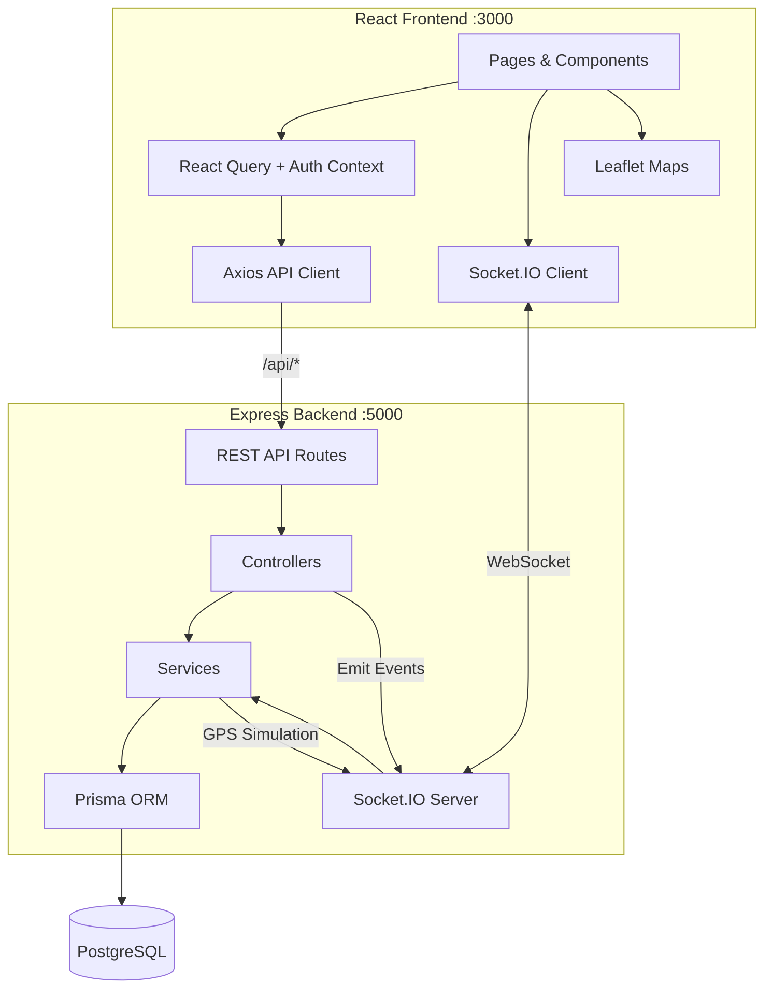

# FleetFlow Technical Audit

**Date:** 2026-08-15  
**Scope:** Full codebase — frontend, backend, database, real-time layer  
**Method:** Static analysis + TypeScript compilation checks. No code was modified.

---

## 1. Executive Summary

FleetFlow is a full-stack fleet management platform with a React/Vite frontend, Express/Prisma backend, PostgreSQL database, and Socket.IO real-time layer. The core shipment lifecycle — creation, smart vehicle allocation, route optimization, GPS simulation, live tracking, delay/reroute handling, and delivery — is **fully implemented and connected end-to-end**.

The main concerns are: **2 critical security issues** (exposed credentials, weak JWT fallback), **~30 backend TypeScript compilation errors** that don't block development but prevent production builds, **route ordering bugs** making some endpoints unreachable, and **unvalidated request bodies** passed directly to Prisma. No tests exist.

---

## 2. Architecture

| Layer | Technology |
|-------|-----------|
| Frontend | React 18, TypeScript, Vite 5, TailwindCSS 3, React Query, Leaflet, Recharts, Socket.IO Client |
| Backend | Node.js, Express 4, TypeScript (tsx), Prisma 5, Socket.IO Server |
| Database | PostgreSQL (8 models, 7 enums) |
| Auth | JWT + bcryptjs, role-based (DISPATCHER / DRIVER) |
| Real-time | Socket.IO — vehicle tracking, status updates, alerts, notifications |
| Maps | Leaflet + OpenStreetMap (no API key needed) |

---

## 3. Feature Status

| Feature | Status | Notes |
|---------|--------|-------|
| User Registration & Login | ✅ COMPLETE | JWT auth, demo credentials in seed |
| Role-based Access | ✅ COMPLETE | DISPATCHER / DRIVER roles |
| Dispatcher Dashboard | ✅ COMPLETE | KPIs, live map, alerts, active shipments |
| Driver Dashboard | ✅ COMPLETE | Active shipment view |
| Shipment CRUD | ✅ COMPLETE | Create, list, detail, update (no delete) |
| Smart Vehicle Allocation | ✅ COMPLETE | 4-factor scoring: capacity, distance, availability, deadline |
| Vehicle Assignment | ✅ COMPLETE | Manual selection from ranked list |
| Route Optimization | ✅ COMPLETE | Haversine + simulated 8-15% improvement (no external API) |
| Dynamic Rerouting | ✅ COMPLETE | Generates new route from current position on delay |
| GPS Simulation | ✅ COMPLETE | Server-side interval, 2s updates along route points |
| Real-time Tracking | ✅ COMPLETE | Socket.IO: position, status, alerts, notifications |
| Route Deviation Detection | ✅ COMPLETE | Auto-alert when >5km from planned route |
| Deadline Miss Detection | ✅ COMPLETE | Auto-alert + DELAYED status when ETA > deadline |
| Fleet Management | ✅ COMPLETE | Vehicle list, detail, create, update, map view |
| Driver Management | ✅ COMPLETE | Driver list, detail, create, update |
| Route Management | ✅ COMPLETE | Route list, detail with map |
| Alerts System | ✅ COMPLETE | 4 alert types, 3 severities, resolve action |
| Notifications | ✅ COMPLETE | DB-persisted + real-time toasts + mark read |
| Analytics Dashboard | ✅ COMPLETE | Charts, optimization metrics, fleet utilization |
| Global Search | ✅ COMPLETE | Debounced search across shipments/vehicles/drivers |
| Dark Mode | ✅ COMPLETE | System/light/dark, localStorage persistence |
| Settings | ✅ COMPLETE | Theme, notifications, sidebar density (client-side only) |
| Simulation Controls | ✅ COMPLETE | Pause/resume/stop from UI |
| Delay Simulation | ✅ COMPLETE | Simulate traffic → alert → reroute → resume |
| Seed Data | ✅ COMPLETE | 2 users, 8 drivers, 12 vehicles, 15 shipments, 8 routes |
| Shipment Cancellation | ❌ NOT IMPLEMENTED | Status enum exists, no endpoint |
| PICKED_UP / ARRIVING Transitions | ❌ NOT IMPLEMENTED | Status enums exist, no trigger endpoints |
| Resource Deletion | ❌ NOT IMPLEMENTED | No DELETE endpoints for any entity |
| Zod Validation | ❌ NOT IMPLEMENTED | Dependency installed but never used |
| Tests | ❌ NOT IMPLEMENTED | No test framework or test files |
| API Documentation | ❌ NOT IMPLEMENTED | No Swagger/OpenAPI |
| Password Reset | ❌ NOT IMPLEMENTED | No forgot-password flow |

---

## 4. Key Issues

### Critical

#### ISSUE-001 — Hardcoded database credentials in committed `.env`

**Severity:** CRITICAL  
**Location:** `server/.env:1`  
**Problem:** The `.env` file contains a plaintext database password and is committed to version control. Although `.env` is in `.gitignore`, the file exists in the repo.  
**Impact:** Database credentials exposed to anyone with repo access.  
**Suggested direction:** Remove from git history, provide `.env.example` with placeholder values.

#### ISSUE-002 — JWT secret fallback to trivially guessable string

**Severity:** CRITICAL  
**Location:** `server/src/middleware/auth.ts:22`, `server/src/controllers/auth.controller.ts:32,72`  
**Problem:** `JWT_SECRET` env var is not defined in `.env`. Code falls back to `'secret'`, making all tokens trivially forgeable.  
**Impact:** Complete authentication bypass in any deployment without the env var set.  
**Suggested direction:** Require `JWT_SECRET` at startup; fail fast if missing.

### High

#### ISSUE-003 — Backend TypeScript compilation fails (~30 errors)

**Severity:** HIGH  
**Location:** `server/src/controllers/shipment.controller.ts` (primary), `vehicle.controller.ts`, `tracking.controller.ts`  
**Problem:** `findUnique` queries without `include` but code accesses relation properties (`.vehicle`, `.route`). Also `req.params` type mismatches and `RoutePoint[]` not assignable to Prisma Json type.  
**Impact:** `tsc` build fails; development works only because `tsx` skips type checking.  
**Suggested direction:** Add `include` clauses, type-narrow params, cast route points.

#### ISSUE-004 — Unvalidated `req.body` passed directly to Prisma update

**Severity:** HIGH  
**Location:** `shipment.controller.ts:165`, `vehicle.controller.ts:122`, `driver.controller.ts:95`  
**Problem:** `updateShipment`, `updateVehicle`, and `updateDriver` pass raw `req.body` to `prisma.*.update({ data: req.body })`.  
**Impact:** Allows overwriting any column including status, IDs, or foreign keys.  
**Suggested direction:** Whitelist allowed fields before passing to Prisma.

#### ISSUE-005 — Notification route `read-all` unreachable

**Severity:** HIGH  
**Location:** `server/src/routes/notification.routes.ts:7-8`  
**Problem:** `PUT /:id/read` is registered before `PUT /read-all`. Express matches `read-all` as `:id` parameter.  
**Impact:** "Mark all read" feature silently fails or hits wrong handler.  
**Suggested direction:** Move `/read-all` route before `/:id/read`.

#### ISSUE-006 — Shipment routes `simulation/control` and `driver/:driverId/active` unreachable

**Severity:** HIGH  
**Location:** `server/src/routes/shipment.routes.ts:24-25`  
**Problem:** These routes are defined after `/:id` catch-all routes. Express matches `simulation` and `driver` as `:id`.  
**Impact:** Simulation control and driver active shipment lookup may fail.  
**Suggested direction:** Move these routes before `/:id` routes.

#### ISSUE-007 — Hardcoded Socket.IO URL in client

**Severity:** HIGH  
**Location:** `client/src/services/socket.ts:3`  
**Problem:** Socket URL is hardcoded to `http://localhost:5000`. Vite proxy handles `/socket.io` path, but the client connects directly to port 5000.  
**Impact:** Works in dev (both ports served locally), breaks in any production/hosted deployment.  
**Suggested direction:** Use environment variable or relative connection URL.

### Medium

#### ISSUE-008 — Missing environment variables

**Severity:** MEDIUM  
**Location:** `server/.env`  
**Problem:** `JWT_SECRET` and `PORT` are not defined. Both have fallback defaults but should be explicit.  
**Impact:** Security risk (JWT_SECRET) and configuration ambiguity.  
**Suggested direction:** Add all required variables to `.env.example`.

#### ISSUE-009 — Fake analytics data fallback

**Severity:** MEDIUM  
**Location:** `server/src/controllers/analytics.controller.ts:99`  
**Problem:** When no shipments exist for a day, random fake data is injected: `count || Math.floor(Math.random() * 5) + 1`.  
**Impact:** Analytics dashboard shows fabricated data, misleading users.  
**Suggested direction:** Remove random fallback; show 0.

#### ISSUE-010 — Shipment number collision risk

**Severity:** MEDIUM  
**Location:** `server/src/utils/helpers.ts:52`  
**Problem:** `SH-${random 1000-9999}` only has 9000 possible values. Unique constraint will catch collisions but with an unhandled 500 error.  
**Impact:** Shipment creation can fail unpredictably at scale.  
**Suggested direction:** Use sequential or timestamp-based IDs.

#### ISSUE-011 — Zod dependency installed but unused

**Severity:** MEDIUM  
**Location:** `server/package.json:26`  
**Problem:** Zod is listed as a dependency but no validation schemas exist. All validation is manual inline checks.  
**Impact:** Wasted dependency; validation is inconsistent and incomplete.  
**Suggested direction:** Either implement Zod schemas or remove the dependency.

### Low

#### ISSUE-012 — No Socket.IO authentication

**Severity:** LOW  
**Location:** `server/src/sockets/tracking.socket.ts`  
**Problem:** Socket connections have no JWT verification. Any client can connect and receive all real-time events.  
**Impact:** Information leakage; acceptable for hackathon demo, not production.  
**Suggested direction:** Add JWT verification middleware to Socket.IO.

#### ISSUE-013 — In-memory simulation state lost on restart

**Severity:** LOW  
**Location:** `server/src/services/simulator.service.ts:15`  
**Problem:** Active simulations are stored in a `Map`. Server restart loses all running simulations without cleanup.  
**Impact:** Vehicles may show stale positions; shipments stuck in IN_TRANSIT.  
**Suggested direction:** Clean up on SIGINT or persist simulation state.

---

## 5. Security Findings

| Finding | Severity | Details |
|---------|----------|---------|
| Exposed DB credentials | CRITICAL | Password visible in committed `.env` |
| Weak JWT secret fallback | CRITICAL | Falls back to `'secret'` when env var missing |
| No input sanitization on updates | HIGH | Raw `req.body` passed to Prisma |
| No Socket.IO auth | LOW | All real-time events accessible without token |
| No rate limiting | LOW | API has no throttling on auth or data endpoints |

---

## 6. Missing / Incomplete Features

- Shipment cancellation endpoint
- PICKED_UP and ARRIVING status transitions
- DELETE endpoints (shipments, vehicles, drivers)
- Zod request validation
- Test suite (unit, integration, e2e)
- API documentation (Swagger/OpenAPI)
- Password reset / forgot password
- External routing API integration (OSRM, OR-Tools)
- Production deployment configuration
- Server-side session/settings persistence

---

## 7. Build & Code Health

| Check | Result |
|-------|--------|
| Prisma schema validation | ✅ PASS |
| Frontend TypeScript (`tsc --noEmit`) | ✅ PASS (0 errors) |
| Backend TypeScript (`tsc --noEmit`) | ❌ FAIL (~30 errors) |
| Backend dev mode (`tsx watch`) | ✅ Works (skips type checking) |
| Frontend build (`vite build`) | ✅ Expected to work (TS passes) |
| Backend build (`tsc`) | ❌ Fails (type errors) |
| Test suite | ❌ None exists |
| Linting | ❌ No ESLint configured |

---

## 8. Recommended Priority

The team should address these items in order of importance:

1. **Remove credentials from git** — Rotate DB password, remove `.env` from git history, create `.env.example`
2. **Require JWT_SECRET** — Fail server startup if not set; never use a fallback
3. **Fix route ordering** — Move `/read-all`, `/simulation/control`, `/driver/:driverId/active` before parameterized routes
4. **Fix backend TypeScript errors** — Add missing `include` clauses, type-narrow `req.params`, cast route point arrays
5. **Whitelist update fields** — Don't pass raw `req.body` to Prisma updates
6. **Remove fake analytics data** — Replace random fallback with `0`
7. **Make Socket.IO URL configurable** — Use env variable or relative URL
8. **Add Zod validation** — Leverage the already-installed dependency
9. **Add basic tests** — At minimum, test auth flow and shipment lifecycle
10. **Add missing status transitions** — Implement PICKED_UP, ARRIVING, and CANCEL endpoints
