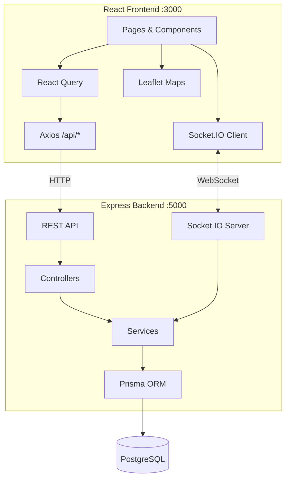

# FleetFlow

**Smart Fleet Coordination & Logistics Management Platform**

A full-stack logistics platform for managing shipments, vehicles, and drivers with real-time GPS tracking, intelligent vehicle allocation, route optimization, and dynamic rerouting — built for the Smart India Hackathon (SIH) 2026.

---

## Overview

FleetFlow enables logistics dispatchers to create shipments, automatically find the best-fit vehicle using a multi-factor scoring algorithm, optimize delivery routes, and monitor the entire journey in real-time on an interactive map. Drivers get their own dashboard to view active assignments. The system detects route deviations and deadline risks automatically, triggers alerts, and can dynamically reroute vehicles around delays.

---

## Key Features

- **JWT Authentication** — Role-based access (Dispatcher / Driver) with registration and login
- **Dispatcher Dashboard** — Live KPIs, fleet map with vehicle positions, active shipments, alerts
- **Driver Dashboard** — Active assignment view with route details
- **Shipment Management** — Create, view, filter (status/priority/search), and update shipments
- **Smart Vehicle Allocation** — 4-factor scoring algorithm (capacity, distance, availability, deadline feasibility) with ranked recommendations
- **Route Optimization** — Haversine-based distance calculation with simulated 8-15% route improvement *(demo — no external API)*
- **GPS Simulation** — Server-side vehicle movement along route points with 2-second intervals
- **Real-time Tracking** — Socket.IO-powered live position updates, status changes, alerts, and toast notifications
- **Delay Simulation & Dynamic Rerouting** — Simulate traffic delays → auto-alert → generate alternative route → resume tracking
- **Route Deviation & Deadline Detection** — Automatic alerts when vehicles deviate >5km or ETA exceeds deadline
- **Fleet & Driver Management** — CRUD operations, detail views, utilization metrics
- **Alerts System** — 4 alert types (route deviation, delay risk, low progress, vehicle offline), 3 severity levels, resolve action
- **Analytics Dashboard** — Fleet utilization, on-time rate, optimization savings, shipment/vehicle charts (Recharts)
- **Global Search** — Debounced search across shipments, vehicles, drivers, and routes
- **Dark Mode** — System/light/dark themes with localStorage persistence
- **Responsive Design** — Mobile sidebar, adaptive grid layouts
- **Seed Data** — Pre-loaded demo data (2 users, 8 drivers, 12 vehicles, 15 shipments, 8 routes)

---

## Technology Stack

| Layer | Technologies |
|-------|-------------|
| Frontend | React 18, TypeScript, Vite 5, TailwindCSS 3, React Query |
| UI | Leaflet (maps), Recharts (charts), Lucide React (icons) |
| Backend | Node.js, Express 4, TypeScript (tsx) |
| Database | PostgreSQL, Prisma 5 ORM |
| Auth | JWT, bcryptjs |
| Real-time | Socket.IO 4 |
| Dev Tools | Concurrently, PostCSS, Autoprefixer |

---

## Architecture



**Key services:**
- **Allocation Service** — Scores all vehicles on 4 weighted factors (capacity 0-30, distance 0-25, availability 0-20, deadline 0-25)
- **Optimization Service** — Calculates baseline vs. optimized routes with nearest-neighbor heuristic for multi-stop
- **Simulator Service** — Drives vehicles along route points via `setInterval`, emitting Socket.IO events and persisting tracking data

---

## Core Workflow

```
Login (JWT) → Dashboard (KPIs + Live Map)
    ↓
Create Shipment (pickup, destination, cargo, deadline)
    ↓
Smart Allocate (4-factor scoring → ranked vehicle list)
    ↓
Assign Vehicle (updates shipment, vehicle, driver statuses)
    ↓
Optimize Route (generates route points, ETA, savings metrics)
    ↓
Start Trip (begins GPS simulation, sets IN_TRANSIT)
    ↓
Live Tracking (real-time position, progress, deviation/deadline checks)
    ↓
[Optional] Simulate Delay → Alert → Dynamic Reroute → Resume
    ↓
Deliver (stops simulation, frees vehicle/driver, resolves alerts)
    ↓
Analytics (fleet utilization, on-time rate, optimization savings)
```

**Not yet implemented:** PICKED_UP transition, ARRIVING transition, shipment cancellation, resource deletion.

---

## Project Structure

```
fleetflow/
├── package.json           # Monorepo scripts
├── client/                # React frontend
│   ├── src/
│   │   ├── pages/         # 18 page components
│   │   ├── layouts/       # AppLayout (sidebar + topbar)
│   │   ├── hooks/         # useAuth, useSocket
│   │   ├── services/      # API client, Socket.IO singleton
│   │   ├── types/         # TypeScript interfaces
│   │   └── utils/         # Theme management
│   └── vite.config.ts     # Dev server + API proxy
├── server/                # Express backend
│   ├── src/
│   │   ├── controllers/   # 11 controllers
│   │   ├── routes/        # 11 route files
│   │   ├── services/      # Allocation, optimization, simulator
│   │   ├── middleware/     # JWT auth
│   │   ├── sockets/       # Socket.IO handlers
│   │   └── utils/         # Haversine, route helpers
│   └── prisma/
│       ├── schema.prisma  # 8 models, 7 enums
│       └── seed.ts        # Demo data
```

---

## Getting Started

### Prerequisites

- **Node.js** v18+
- **PostgreSQL** running on `localhost:5432`
- A database named `fleetflow`

### Installation

```bash
# Clone the repository
git clone <repo-url>
cd fleetflow

# Install all dependencies (root + server + client)
npm run install:all
```

### Environment Variables

Create `server/.env`:

```env
DATABASE_URL="postgresql://<user>:<password>@localhost:5432/fleetflow?schema=public"
JWT_SECRET="<your-secure-secret>"
PORT=5000
```

> ⚠️ **Never commit real credentials.** See `PROJECT_AUDIT.md` for security findings.

### Database Setup

```bash
# Run Prisma migration + seed demo data
npm run db:setup

# Or individually:
npm run db:migrate    # Apply schema
npm run db:seed       # Insert demo data
```

### Running the Project

```bash
# Start both frontend and backend concurrently
npm run dev
```

- **Frontend:** http://localhost:3000
- **Backend API:** http://localhost:5000
- **Health check:** http://localhost:5000/api/health

### Demo Credentials

| Role | Email | Password |
|------|-------|----------|
| Dispatcher | `demo@fleetflow.com` | `demo123` |
| Driver | `driver@fleetflow.com` | `demo123` |

---

## Current Status

**28 features fully implemented** including the complete shipment lifecycle, smart allocation, route optimization, GPS simulation with real-time tracking, and analytics.

**Not yet implemented:** Shipment cancellation, some status transitions (PICKED_UP, ARRIVING), resource deletion, Zod validation, tests, API docs.

**Known issues:** Backend TypeScript compilation has ~30 type errors (runs fine in dev mode via `tsx`). See [PROJECT_AUDIT.md](PROJECT_AUDIT.md) for the full bug report, security findings, and prioritized recommendations.

---

## SIH Context

FleetFlow is being developed for **Smart India Hackathon (SIH) 2026** as a smart fleet coordination solution addressing logistics optimization challenges in India. The platform demonstrates intelligent vehicle allocation, route optimization with real-time rerouting, and GPS-based fleet monitoring across Indian cities.

---

## Contributors

<!-- Add team member names and roles here -->

| Name | Role |
|------|------|
| | |
| | |
| | |

---

## License

This project was created for SIH 2026.
